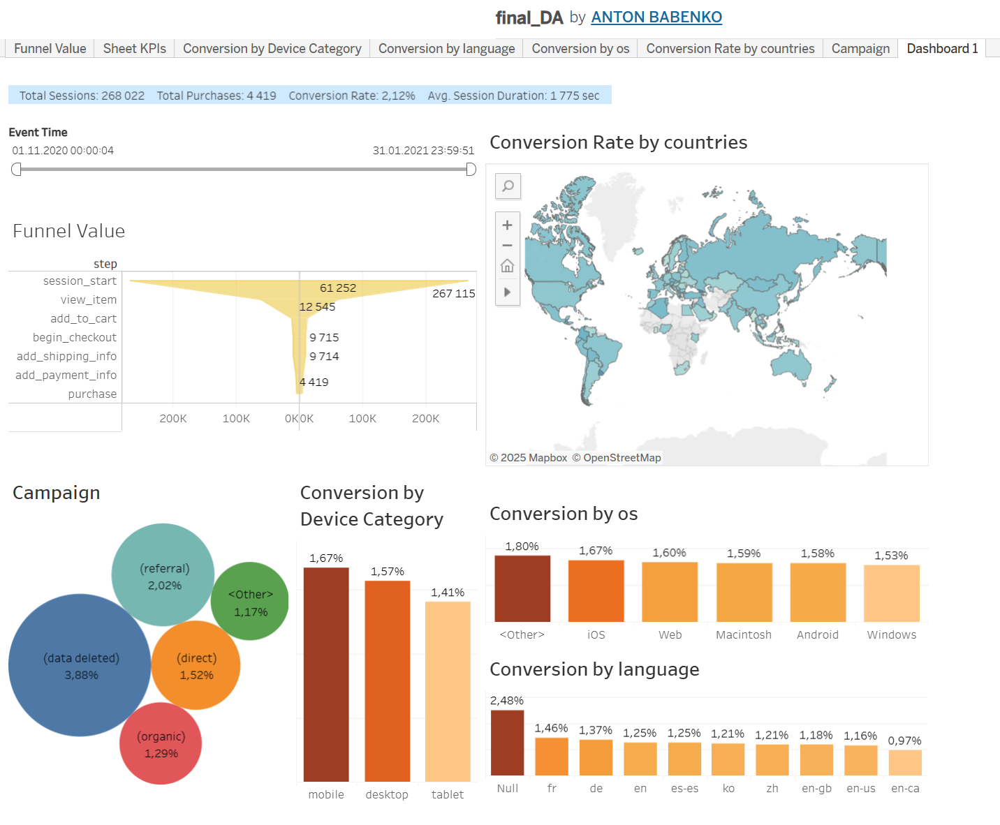
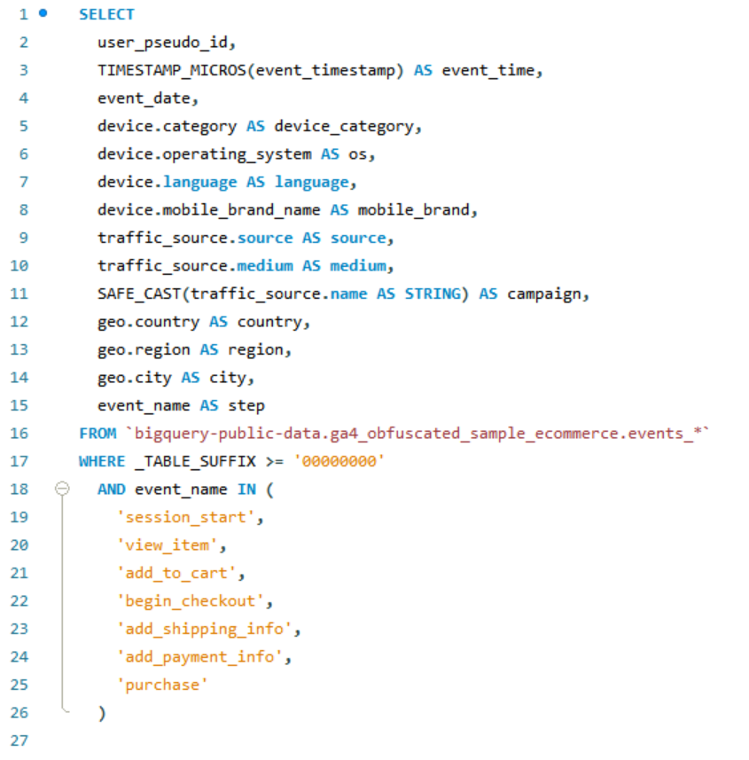

# Customer Retention Dashboard

This project presents a dashboard created for analyzing user behavior and monetization metrics of a digital product. It includes SQL data preparation using PostgreSQL and a Tableau Public dashboard.

## 📊 Key Metrics Covered

- Monthly Recurring Revenue (MRR)
- Paid Users
- Average Revenue Per Paid User (ARPPU)
- New Paid Users
- New MRR
- Churned Users
- Churn Rate
- Churned Revenue
- Revenue Churn Rate
- Customer Lifetime (LT)
- Customer Lifetime Value (LTV)

## 🖼️ Dashboard Preview

## 🛠 SQL Query Preview

## ▶️ Video Demonstration

Watch the video demo of the project on YouTube:  
👉 [https://youtu.be/gkC3pP_tc1w](https://youtu.be/gkC3pP_tc1w)

## 🛠 Technologies Used

- **PostgreSQL** – SQL queries for data preparation  
- **DBeaver** – SQL query execution  
- **Tableau Public** – Data visualization  
- **GitHub** – Version control and project showcase

## 🔗 Dashboard Link

👉 [View on Tableau Public]([https://public.tableau.com/app/profile/your_name/viz/your_dashboard_link](https://public.tableau.com/views/final_DA_17525341835200/Dashboard1?:language=en-US&:sid=&:redirect=auth&:display_count=n&:origin=viz_share_link)) 

## 📦 Folder Structure

## 📣 Author

Anton Babenko — Data Science & Analytics student @GoIT
